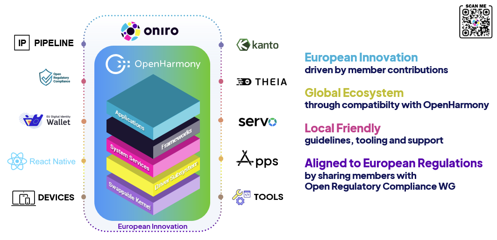

# 🌐 Welcome to Eclipse Oniro for OpenHarmony

**Oniro** is an Eclipse Foundation Project dedicated to the development of an open source vendor-neutral Operating System (OS) platform. The Oniro Project was established through a collaboration between two global open source foundations: The Eclipse Foundation and The OpenAtom Foundation. Leveraging the solid foundation of *OpenHarmony*, an open source project operated by the OpenAtom Foundation, Oniro builds upon an operating system platform known for its versatility across a wide range of smart devices.

The goal of this project is to build upon OpenHarmony, extending it with additional functionalities tailored for global markets. This collaboration between the Eclipse Foundation and the OpenAtom Foundation is aimed at driving the development and adoption of OpenHarmony on a global scale.

## 🚀 Think Global, Code Local

**Oniro prioritizes**: 
- 🔗 Seamless Interoperability
- 🧩 Modularization
- 🎨 Visually Appealing User Interface

## 🛠 What You’ll Find Here

The Eclipse Oniro for OpenHarmony organization hosts a diverse and evolving collection of repositories that support the development, integration, and extension of OpenHarmony within the Oniro Project. Here you'll find:

* 🧩 **Platform Extensions**: Core components, middleware, and integrations tailored to extend OpenHarmony for broader and more localized use cases.
* 🧪 **Innovative Applications**: A growing suite of demo and utility apps built on Oniro, showcasing its capabilities across various domains.
* 🔧 **Hardware Enablement**: Board support packages and vendor layers for a range of supported devices, especially for development and prototyping.
* ⚙️ **Developer Tools & Infrastructure**: Tools for building, packaging, and deploying Oniro-based applications, along with CI/CD automation scripts and IDE integrations.
* 🛡 **Compliance & Configuration**: Resources focused on aligning Oniro with international standards and regulatory requirements.

## 📣 Get Involved

Whether you’re a developer, researcher, policymaker, or enthusiast — we welcome your contributions!

- 🧑‍💻 Contribute code, ideas, or documentation to our repositories.
- 📬 Join our weekly calls every Thursday listed in the [**Oniro Calendar**](https://calendar.google.com/calendar/embed?src=c_d73vnjj36rufvora32gdfc8508%40group.calendar.google.com&ctz=Europe%2FParis) [iCal](https://calendar.google.com/calendar/ical/c_d73vnjj36rufvora32gdfc8508%40group.calendar.google.com/public/basic.ics)
- 📢 Join our [Matrix Channels](https://chat.eclipse.org/#/room/#oniro:matrix.eclipse.org) and get engaged in the community discussions 

## 🔗 Related Resources

- [Oniro Project Website](https://oniroproject.org)
- [Oniro Documentation](https://docs.oniroproject.org/)
- [OpenHarmony Project](https://www.openharmony.cn/)
- [Eclipse Foundation](https://www.eclipse.org/)
